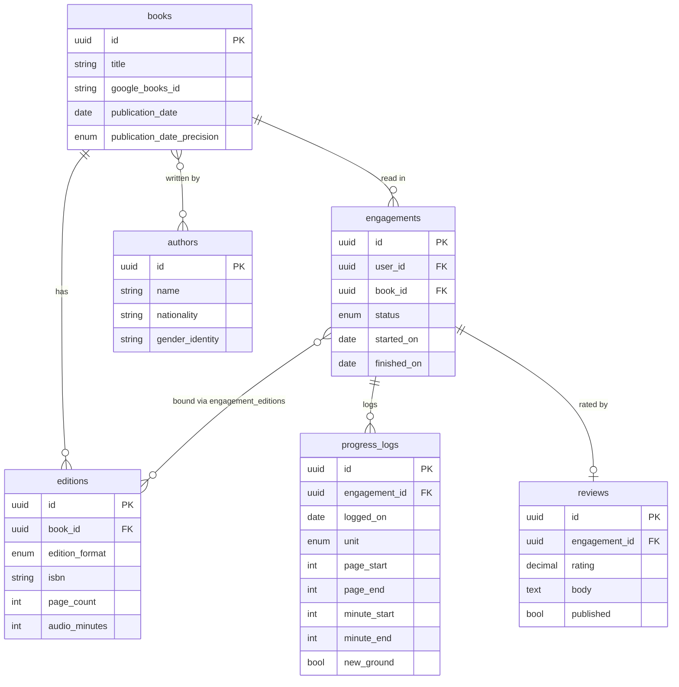

# Architecture

An orientation map: how the pieces are wired, and the shape of the data model in one picture. This
page deliberately doesn't re-argue the design — the
[Architecture Decision Records](decisions/README.md) are the durable home for _why_ each choice was
made. Start here to get your bearings, then follow a link when you want the reasoning.

---

## System at a glance

Three pieces, one deployment ([ADR-0001](decisions/0001-tech-stack-angular-fastapi-postgres.md)):

- **Angular** single-page frontend.
- **FastAPI** backend — a JSON API under `/api`, which _also_ serves the built Angular app as static
  files (any non-`/api` path falls back to `index.html` so client-side routing works). One process,
  one deploy.
- **PostgreSQL 18** — the system of record, doing real work: enums, array columns, partial unique
  indexes, and row-level security.

A typical request:

```
Browser ──▶ FastAPI
             │  1. SessionMiddleware reads the signed session cookie
             │  2. get_current_user_id() pulls user_id from the session (401 if absent)
             │  3. get_db() opens a connection and sets app.current_user_id on it
             │  4. Postgres RLS policies use that setting to filter every personal row
             ▼
          PostgreSQL
```

Two things worth knowing about the wiring:

- **Google Books is proxied through the backend**, never called from the browser
  ([ADR-0015](decisions/0015-google-books-access-via-backend-proxy.md)) — keeps the API key
  server-side and gives one place to shape external data into our model.
- **Auth is Google OAuth + an email allowlist** (via Authlib). On success the user id goes into a
  signed session cookie; only allowlisted emails can get a session at all.

---

## Backend at a glance

`app/` is layered by responsibility, each with one job
([ADR-0025](decisions/0025-api-services-crud-layering.md)):

- **`app/api/`** — routers. Parse and validate the request, call a service function (or, for routes
  with no real logic, a `crud` instance directly), commit, shape the response. Router files that
  outgrow one concern split into a package instead of staying flat — `engagements.py` (698 lines)
  became `app/api/engagements/{lifecycle,progress_logs,bindings,reviews}.py`, each paired with a
  matching file under `app/services/engagements/`.
- **`app/services/`** — business logic. One function per operation that has actual rules to enforce
  (`create_book`, `import_book_from_google`, engagement lifecycle transitions, review upsert) —
  plain functions, callable independent of FastAPI, so a rule needed by two routes has exactly one
  implementation to find or change.
- **`app/crud/`** — a single generic `CRUDBase[ModelType]` (`get`, `get_or_raise`, `get_by`, `list`,
  `list_by`, `create`, `update`, `delete`, `get_or_create`), instantiated once per model in
  `crud/__init__.py` (`book_crud`, `engagement_crud`, …) and imported from there by everything else,
  instead of each model growing its own get/list/create/update/delete boilerplate.

`app/exceptions.py` defines plain-Python `NotFoundError`/`ConflictError`/`InvalidOperationError` (no
FastAPI dependency), with `register_exception_handlers()` mapping each to an HTTP status once in
`main.py` — how `crud`/`services` code raises domain errors without importing FastAPI or
hand-rolling `HTTPException` in every router.

---

## Frontend at a glance

The Angular app uses modern Angular's defaults — standalone components and signals — with a thin
service layer over the `/api` endpoints:

- **Standalone components, organized by feature.** Each screen or sheet is its own folder
  (`currently-reading`, `book-search`, `progress-log-sheet`, `insights`, `nav-shell`, …), with
  templates moving out of inline strings into their own `.html` files as the app matures.
- **A thin service layer over a generated client.** Three injectable services — `auth`, `book`, and
  `engagement` — wrap the `/api` endpoints; there's no store beyond them. The HTTP calls and types
  themselves come from an orval-generated client, typed straight from the backend's OpenAPI schema
  ([ADR-0026](decisions/0026-generated-frontend-api-client-orval.md)); the hand-written services
  delegate to it and keep only the rxjs caching/reload layer (e.g. `books$`, the
  engagements-by-status cache) that generation doesn't cover.
- **Signals for state, reactive forms for input.** Component state lives in signals and `computed`;
  input uses reactive `FormControl`s. (The [learnings notes](learnings/README.md) are mostly
  hard-won lessons from exactly this.)
- **Route guards.** `auth.guard` and `guest.guard` gate logged-in versus logged-out routes — the
  client-side half of the auth story the backend enforces.

---

## The data model at a glance

The full reasoning is spread across [ADRs 0002–0008 and 0021](decisions/README.md); the one-picture
version: `books`/`authors`/`editions` are **shared, user-agnostic** reference data, while everything
hanging off `engagements` is **personal** and per-user. A read is an `engagement` (its own
lifecycle, re-reads as new rows); it binds to `editions` for format; progress is a log of
page/minute _activities_, not a stored position.



The `engagements`↔`editions` binding (`engagement_editions`) also records each bound copy's owner
and an optional `length_override`. The top-row tables carry no owner; everything below `engagements`
is per-user — enforced as follows.

---

## How per-user isolation is wired

The central guarantee — a user only ever reads or writes their own rows
([ADR-0023](decisions/0023-per-user-data-isolation-via-rls.md)) — is enforced in **two layers**:

1. **Postgres row-level security.** Each request runs `SELECT set_config('app.current_user_id', …)`
   on its connection (in the `get_db` dependency); RLS policies on the personal tables compare rows
   against that setting, so the _database itself_ refuses another user's rows regardless of the
   query. Shared reference tables and the auth path use a separate **unscoped** dependency
   (`get_unscoped_db`), because joins out to `books`/`authors`/`editions` must stay unrestricted.

2. **Composite foreign keys.** Personal child tables (`progress_logs`, `reviews`,
   `engagement_editions`) don't just carry a `user_id` — they foreign-key to the _composite_
   `(engagements.id, engagements.user_id)`. That makes it structurally impossible for one user's row
   to reference another user's engagement, before RLS is even considered. Belt and suspenders.

---

## Migrations

Schema changes are managed by **Alembic** — config in `backend/alembic.ini`, revisions under
`backend/migrations/`. `alembic upgrade head` runs automatically when the container starts (see
[Deployment](#deployment)), so every deploy brings the database to the latest revision before the
app serves traffic.

---

## Deployment

The frontend and backend deploy together as a **single Docker image**: the build compiles the
Angular app and bundles it into the FastAPI container, which serves both the API and the static
frontend. One deploy, no separate frontend host.

It runs on **[Railway](https://railway.app)**, connected to the GitHub repo — a push rebuilds and
redeploys — alongside a Railway-managed **Postgres** instance. The live app is at
[rainbowsamreads.fun](https://rainbowsamreads.fun).
