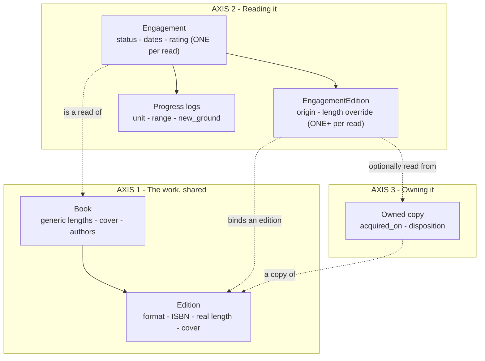
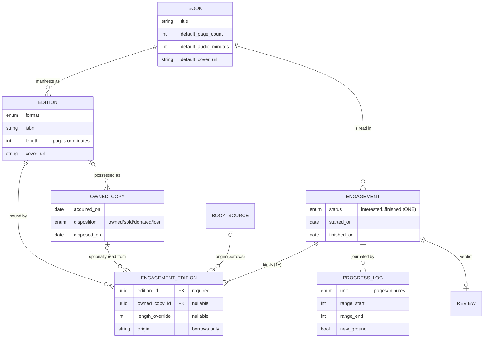
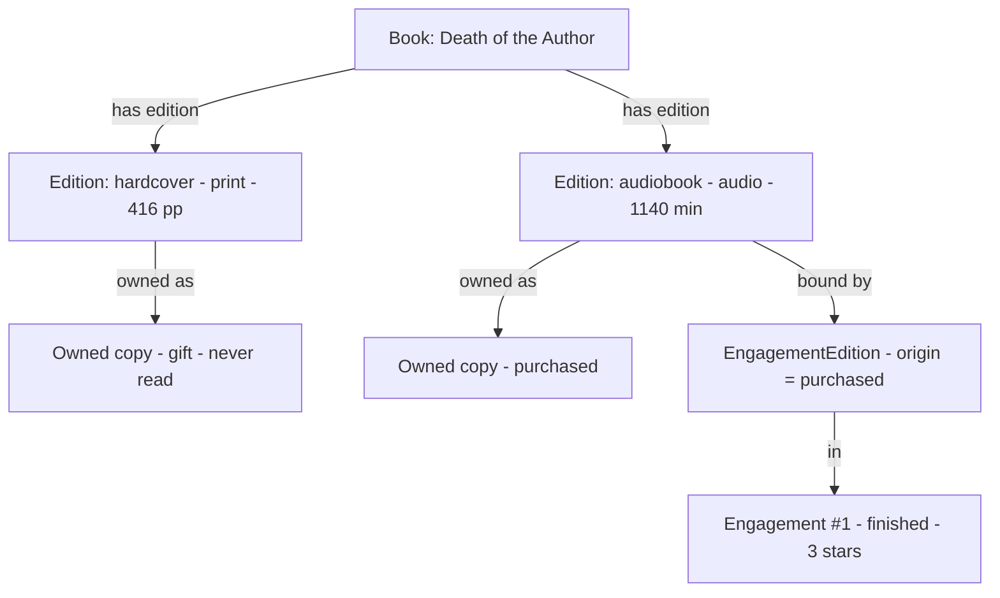

# 0021. Editions own format; a read binds to them via EngagementEdition

- Status: Accepted
- Date: 2026-06-16
- Supersedes: [[0009-origin-per-read-isbn-provisional]]

## Context

The reading axis ([[0005-engagements-lifecycle-entity]]) records how a book was read. When a read
mixes formats, `formats` is already a **set** ([[0006-format-descriptive-set]]) — but its companions
were never pluralised. The engagement still carries a **single** `source_id`, `isbn`, `acquired_on`,
and a fixed pair of totals (`custom_page_count` / `custom_audio_minutes`). So the model admits a
read spans several _formats_ while assuming a single _source, edition, acquisition, and length_.
That inconsistency is the bug filed as issue 19.

The driving case breaks it outright: an immersive combo — the **hardcover I own** read by day, the
**Libby audiobook** by night — is one read with two formats, **two origins** (shelf vs. libby),
**two editions/ISBNs**, and **two lengths** (pages vs. minutes), one of them owned and one borrowed.
A single `source_id` cannot hold two origins in one read.

Two further pressures shape the fix:

- **The Pagebound vs. StoryGraph spectrum.** Most reads (library, Libby) need only a _format_ and a
  _length_; the specific edition/ISBN is noise I don't want to enter. StoryGraph forces an edition
  pick immediately ("55 editions →"); Pagebound lets you just pick a format and a page count, and
  enrich later. The model must support both ends.
- **Format is two different things.** On an _edition_, format is intrinsic and tense-neutral — the
  audiobook edition simply **is** audio; no reading is involved. On the _reading_ side it describes
  how I consumed the book. The single enum was doing both jobs, which is why tagging an unread,
  Interested book with a "reading format" felt wrong: nothing has been read yet.

## Decision

### 1. Introduce **Edition** — a shared manifestation that owns format

An `Edition` is a real-world manifestation of a `Book`: its `format`, `isbn`, real length (pages or
minutes), and cover. It is **user-agnostic shared data** like the book itself
([[0002-books-are-user-agnostic]]) — one book has many editions, each reusable across reads and
copies. **Format lives here**, as an intrinsic property of the edition, and the enum is renamed
`ReadingFormat → Format` to shed the "reading" connotation it never warranted on an edition.

The `Book` keeps **generic per-format defaults** (`default_page_count` / `default_audio_minutes` /
cover); the lightweight path binds to a **generic edition** carrying those, while a **specific
edition** (real ISBN) is the optional upgrade. This also gives `isbn` its true home:
[[0009-origin-per-read-isbn-provisional]] guessed `owned_copies` only because it had no edition
entity to point at; the real home is a shared `Edition` that **both** an owned copy and a read
reference.

### 2. Introduce **EngagementEdition** — the binding of a read to an edition

`EngagementEdition` joins an engagement to an edition, the same way `BookAuthor` joins a book to an
author — a join entity carrying the attributes that belong to neither side alone. **One engagement
binds one or more editions**; the happy path is exactly one, a combo is simply more than one (no
special "combo" shape, the same move [[0006-format-descriptive-set]] made for the format set).

It carries the **per-read facts**: `origin`, a `length_override`, and an optional link to an
`owned_copy`. It does **not** carry a format — the read's format(s) **derive** from the editions it
binds. It always binds a **real edition** (generic or specific), so format and length always have a
home on the edition side.

This splits the engagement along **cardinality**:

- **One per read → the engagement:** `status`, the lifecycle dates, the `rating`, the `review`, and
  the single journal of progress logs ([[0007-progress-logs-activities-not-positions]]).
- **Many per read → the EngagementEdition:** the edition bound, its `origin`, `length_override`, and
  owned link.

The combo proves they cannot merge: a 5-star verdict belongs to _the read_, not to either binding;
two editions with two lengths cannot sit on one engagement. And the binding is real even at
cardinality one — a single-format read is one engagement and one `EngagementEdition`, exactly as a
single-author book is one `Book` and one `BookAuthor`. The engagement today tries to be both
experience and binding; issue 19 is the report that the merged row can't hold the plural half.

### 3. Relocate the facts to the axis each belongs to

- **`format` → `Edition`** (intrinsic; the read derives its format set from the editions bound).
- **`isbn` and cover → `Edition`** (edition-level facts; one work has many).
- **`acquired_on` → `owned_copy`.** Acquisition powers "bought this year," "from shelf vs. recently
  bought," "languished on the shelf" — all **ownership-and-time** derivations about a copy I
  possess; none mean anything for a library loan. [[0009-origin-per-read-isbn-provisional]] called
  it _permanently per-read_; it is really a **possession** fact, parked on the engagement only
  because `owned_copies` didn't exist yet. It moves to the owned copy, alongside its disposition
  lifecycle ([[0003-three-independent-axes]]: owned → kept / sold / donated / lost, retained on
  disposal).
- **`origin` → the EngagementEdition, derived for owned reads.** The _channel_ (libby, library,
  borrowed) is per-read and stays a typed `book_sources` reference
  ([[0010-user-extensible-reference-tables]]). But for a binding tied to an owned copy, origin is
  **derived, not typed** ([[0004-derive-dont-store]]): "purchased" vs. "from shelf" is a function of
  the read's start against the copy's `acquired_on`. This is what lets the _first_ read of a freshly
  bought book read as "purchased" and a _re-read_ of the same copy years later read as "from shelf"
  — two correct labels from one copy, with no second edition invented to fake it.
- **`formats` → derived** from the bound editions. The descriptive set
  ([[0006-format-descriptive-set]]) becomes a projection; an early _intention_ on an Interested
  engagement is expressed by binding the intended (generic) edition, not by tagging a format.
- **Length → a fallback chain, with the per-read override preserved.** The completion denominator is
  `binding override → edition length → book per-format default`. The override is not the edition's
  length; it is a personal correction (a 1100-page omnibus whose last 100 pages are backmatter art,
  logged against 1000). `custom_page_count` / `custom_audio_minutes` survive in this role as
  `length_override` on the binding.

### The spectrum, concretely

- **Lightweight (most reads):** bind to the book's **generic** edition for a format, accept its
  default length, `owned` off. No ISBN, no friction.
- **Specific (owned, or when I care):** bind to a real `Edition` (its ISBN, real length, cover) and
  `owned_copy`. Origin derives; data logs against that edition.

### Phasing

This is the target design, recorded now while it's cheap to get right. The `engagements` table
already holds the flat single-source columns, so adopting this **is a schema migration** — but no
production data exists, so there's nothing to back-fill or preserve; the cost is writing the
migration, not protecting data. The one structural call worth locking before MVP accumulates rows is
that the per-read facts live on `EngagementEdition`, not as flat columns on the engagement — moving
them once data exists is the expensive change. When `Edition` and `owned_copy` get built, and how
generic editions are materialised, is ordinary sequencing, settled in the issues, not by this
decision.

## Diagrams

Three axes ([[0003-three-independent-axes]]) with `Edition` as the shared hub that owns format:

The structure:

A worked instance — _Death of the Author_, owned in both editions, read only in audio:

## Consequences

**Makes easy:**

- The immersive combo, and any mixed read, is one engagement binding several editions — two origins,
  two editions, two lengths, no fake second read.
- "Owned twice, read once" falls out: an owned copy with no binding is owned-and-unread, with no
  reading status to get stuck in.
- "Purchased" on first read and "from shelf" on a re-read of the _same_ copy, derived from one
  `acquired_on` — the StoryGraph stat that can't be told apart today.
- Re-borrowing or re-reading a known edition reuses it; nothing is re-entered.
- An Interested book with a format in mind is just a binding to the intended (generic) edition — no
  "reading format" claimed on something unread.
- The frictionless default (generic edition) and the specific path (a real owned edition) coexist —
  Pagebound flexibility without the StoryGraph edition-trap.

**What we accept:**

- More tables and joins. A happy-path read is still one engagement and one binding, but every reader
  iterates bindings rather than reading a column, and format/length come from the edition.
- `formats`, `origin` (for owned reads), and completion are all derived
  ([[0004-derive-dont-store]]); more logic in the query/API layer.
- Two bindings of the **same** format in one read (a print and a digital edition both logged in
  pages) can't be told apart by unit alone for per-binding attribution — accepted as low-stakes; the
  pages are still counted.

## Alternatives considered

- **Keep the flat single-source columns on the engagement** — cannot represent two
  origins/editions/lengths in one read. The issue-19 bug. Rejected.
- **Hybrid: flat on the engagement for single-format reads, break out a child only for combos** —
  two homes for one fact plus a stateful transition: a read going combo mid-stream (the common case)
  forces facts to _move_ off the engagement and the columns to null. Strictly more moving parts than
  always-binding. Rejected.
- **Put `format` on the read side as a "reading format"** — the read doesn't own its format; the
  edition does. A read-side format duplicates the edition's and produces the "reading format on an
  unread book" awkwardness. Rejected in favour of deriving it.
- **Put `isbn` on `owned_copies` only** ([[0009-origin-per-read-isbn-provisional]]'s plan) — no home
  for the edition of a _borrowed_ read, and no reusable edition object. Superseded by the shared
  `Edition`.
- **Force a specific edition pick on every read** (StoryGraph) — the friction this rejects; most
  reads don't have or want an ISBN. The generic edition is the lightweight default instead.
- **Collapse engagement and its binding into one entity** — a combo then needs two rows, i.e. two
  statuses, two ratings, two journals for one experience — the collapse
  [[0005-engagements-lifecycle-entity]] exists to refuse. Rejected.

## Revisit when

- A single read needs two bindings of the **same** format told apart for stats (today's low-stakes
  print-and-digital case becomes high-stakes) — bindings would need per-binding log attribution
  rather than unit-based.
- The lightweight/specific spectrum needs more than the generic/specific split — e.g. a partial
  edition with some fields but no ISBN becomes a first-class thing to query.
